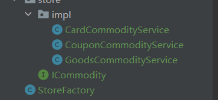

### 1.工厂模式

这种模式的整体架构如下

这种架构非常常见，在手写RPC框架中，也有所涉及。
比如：
1. 实现不同的注册中心，就是定义了一个Register接口，然后不同的注册中心去实现，一个Factory去获取改接口实例。
2. 实现不同的序列化器，定义一个serialize接口，不同的序列化器去实现，然后一个工厂获取。
3. 本项目也是如此。本项目是，发放商品时，可以发放各种不同的商品，因此可以采用工厂模式。
